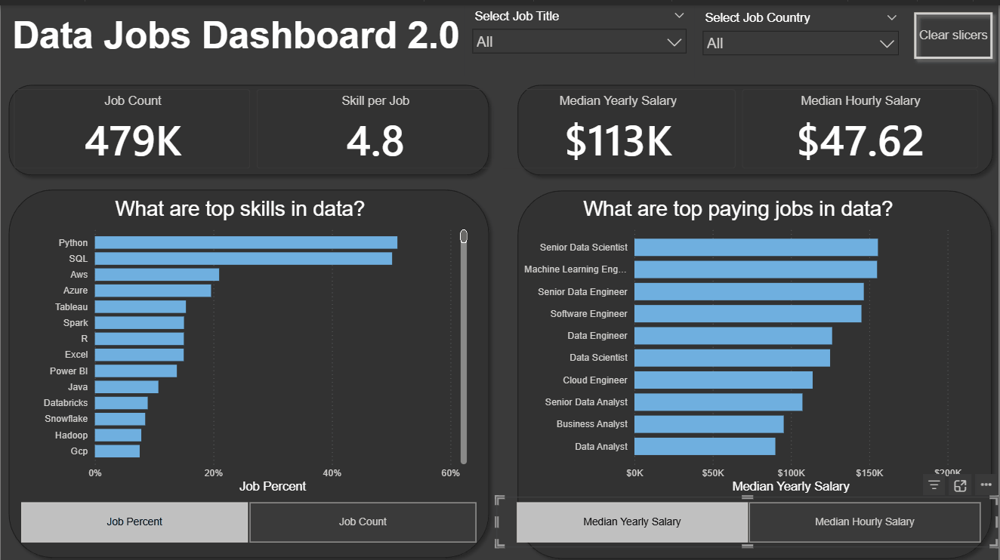
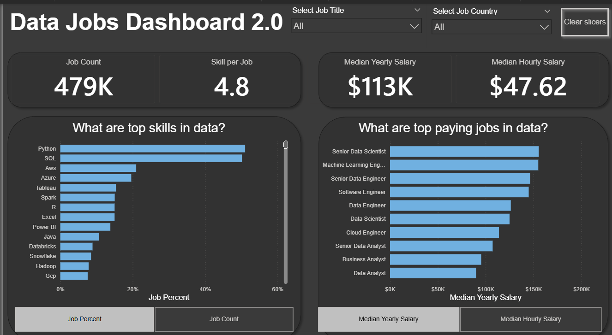

# Data Jobs Dashboard 2.0 | Power BI

## Overview
This project is an interactive Power BI dashboard built to analyze the 2024 data jobs market. Using real-world job posting data, it helps users explore salary trends, skill demand, and job distribution in one clear, business-focused report.

The goal was to turn scattered market data into a practical dashboard that supports faster and better career decisions.

### Dashboard File
You can find the dashboard file here: [`Data Jobs Dashboard 2.0.pbix`](Data%20Jobs%20Dashboard%202.0.pbix).

## What This Project Demonstrates

* **Dashboard Design:** Crafting an intuitive and visually appealing report layout.
* **Power Query ETL:** Performing data cleaning, shaping, and transformation.
* **Data Modeling:** Building efficient data models with relationships (Star Schema principles).
* **DAX Fundamentals:** Creating calculations and aggregations to derive key insights.
* **Visualizations Utilized:**
    * **Core Charts:** Column, Bar, Line, and Area charts for comparisons and trends.
    * **Map Charts:** For displaying geospatial data.
    * **Cards:** To highlight key performance indicators.
    * **Tables:** For presenting detailed, tabular information.
    * **Chart Variety:** Selecting from common and uncommon chart types for effective storytelling.
* **Interactive Features:**
    * **Slicers:** Enabling dynamic, user-driven data filtering.
    * **Buttons & Bookmarks:** For streamlined navigation and managing report views (including Drill-Through).

## Dashboard Highlights

This version of the dashboard is built as a **single-page report** focused on the most useful job-market insights.

It allows users to quickly analyze:
- **Job Count**
- **Skills per Job**
- **Median Yearly Salary**
- **Median Hourly Salary**
- **Skill Popularity** by job count or job percent
- **Salary differences across job titles**

## Why This Project Matters
This project shows the ability to move from raw data to a finished analytical product. It combines data preparation, modeling, KPI creation, and visual storytelling in a format that is easy to use and easy to understand.

## Conclusion
Data Jobs Dashboard 2.0 shows how Power BI can be used to transform job posting data into a concise and useful market analysis tool. The report is designed to help users explore the data job market efficiently and make more informed decisions.
