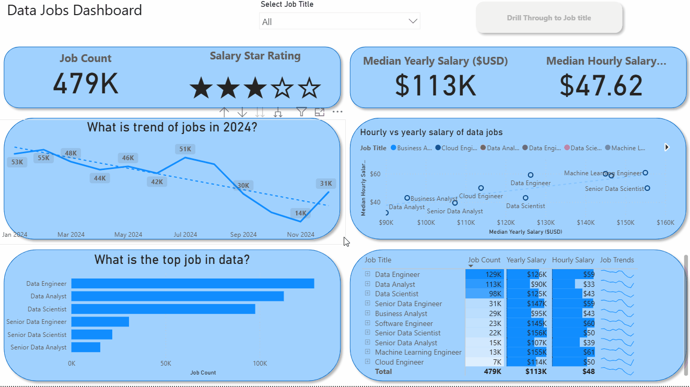
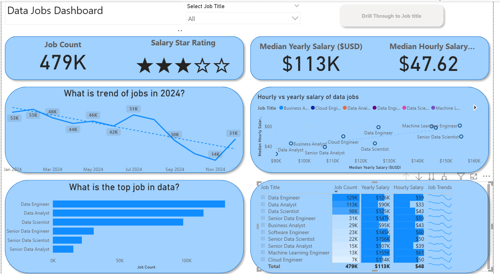
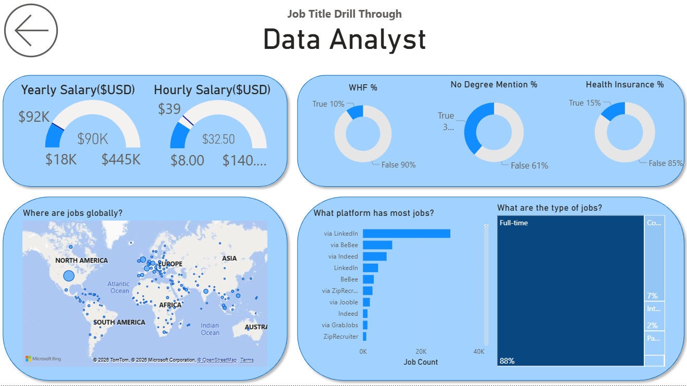

# Data Jobs Dashboard

## Introduction
This project presents an interactive dashboard built to analyze the 2024 data jobs market. Using job posting data such as titles, salaries, and locations, the report helps users quickly understand demand, compensation, and market patterns.

The dashboard was designed for people who want a clear view of the data job market in one place instead of searching through scattered sources.

### Dashboard File
You can find the dashboard file here: [`Data_Jobs_Dashboard.pbix`](Data_Jobs_Dashboard.pbix).

## What This Project Shows
-   **Data Transformation (ETL) with Power Query** Cleaned, shaped, and prepared the raw data for analysis by handling blanks, changing data types, and creating new columns.
-   **Implicit Measures:** Formulated measures to derive key insights and KPIs like `Median Yearly Salary` and `Job Count`.
-   **Core Charts:** Utilized **Column, Bar, Line,** and **Area Charts** to compare job counts and track trends over time.
-   **Geospatial Analysis:** Leveraged **Map Charts** to visualize the global distribution of jobs.
-   **KPI Indicators & Tables:** Used **Cards** to display key metrics and **Tables** to provide granular, sortable data.
-   **Dashboard Design:** Designed an intuitive and visually appealing layout, exploring both common and uncommon chart types to best tell the data story.
-   **Interactive Reporting:**
    -   **Slicers:** To dynamically filter the report by Job Title.
    -   **Buttons & Bookmarks:** To create a seamless navigation experience.
    -   **Drill-Through:** To navigate from a high-level summary to a contextual, detailed view.

## Dashboard Overview
The report is divided into two pages.

### Page 1: Market Overview

This page gives a high-level view of the data jobs market, including job volume, salary metrics, top roles, and market trends.

### Page 2: Job Title Details

This page allows a deeper look at a selected job title, including salary range, work-from-home share, hiring platforms, and job locations.

## Conclusion
This project shows how raw job posting data can be turned into a clear and useful dashboard for market analysis. It highlights practical skills in reporting, data analysis, Power Query and presenting insights in a way that is easy to understand.
